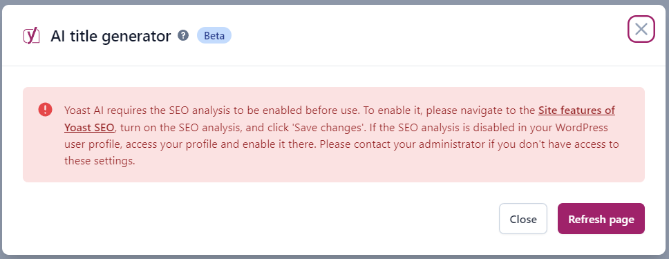
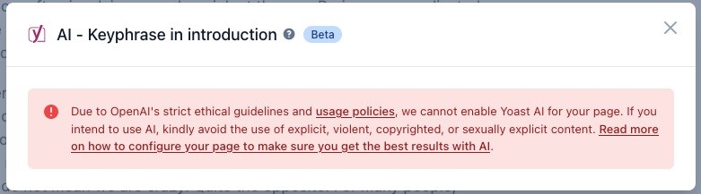

This documentation provides information about the errors displayed by the [Yoast AI](https://yoast.com/features/ai-generated-titles-and-meta-descriptions/#utm_medium=software&utm_source=yoast-seo&utm_term=ai-feature-page&utm_content=ai-modal) features of the [Yoast SEO](https://yoast.com/wordpress/plugins/seo/) plugin.

## SEO analysis required
Our Yoast AI optimization tool, requires the SEO analyses to be enabled in the settings of the plugin. When a premium user try to make use of the AI features whithout having the SEO analyses enabled, the following error message will be shown: 

Example of the SEO analysis requirement error

## Unethical Usage Error
The use of the Yoast AI features relies on the [Azure OpenAI](https://learn.microsoft.com/en-us/azure/ai-services/openai/concepts/content-filter?tabs=warning%2Cpython-new#text-content) content filtering, which enforces its usage policies concerning unethical content. The model filters for hate, sexual, violence, and self-harm content. 

When a Yoast Premium user tries to use the Yoast AI features in a post, the AI will scan the content for unethical content. If any is found, the Yoast AI will display an error.

Example of the ethical content policy violation error
