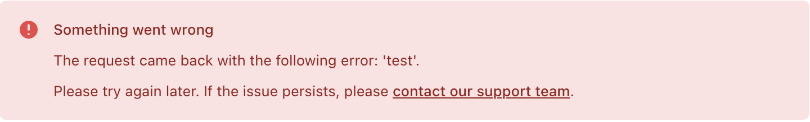
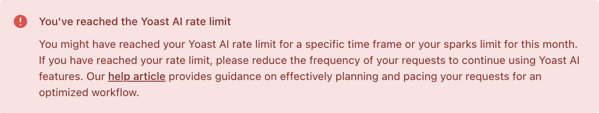

import Tabs from '@theme/Tabs';
import TabItem from '@theme/TabItem';

This documentation provides information about the errors displayed by the [Yoast AI features](https://yoast.com/features/ai-generated-titles-and-meta-descriptions/) of the [Yoast SEO Premium](https://yoast.com/wordpress/plugins/seo/) plugin. All Yoast AI features connect to the Yoast AI API, which in turn connects to an AI service provider (currently: [OpenAI](https://openai.com/)). Below, we list the possible error messages based on the [HTTP response status codes](https://developer.mozilla.org/en-US/docs/Web/HTTP/Status) received from this API.

## 400 responses
This section lists the errors that are displayed for [400 Bad Request](https://developer.mozilla.org/en-US/docs/Web/HTTP/Status/400) responses.

### "Unethical request" error
The Yoast AI features rely on the [Azure OpenAI](https://learn.microsoft.com/en-us/azure/ai-services/openai/concepts/content-filter?tabs=warning%2Cpython-new#text-content) content filtering system, which has a policy against unethical content. The system flags input that includes hate, violence, self-harm references or sexual content. 

This error message is displayed when your content does not pass the content filter system.

:::note[Error message]
<Tabs>
<TabItem value="error-text" label="Text">**Usage policy violation**<br/>Due to OpenAI's strict ethical guidelines and usage policies, we cannot generate suggestions for the content on this page. If you intend to use AI, kindly avoid the use of explicit, violent, copyrighted, or sexually explicit content. In case you need further help, please contact our support team.</TabItem>
<TabItem value="error-image" label="Screenshot"></TabItem>
<TabItem value="error-links" label="Links">The message includes links to: the [OpenAI usage policies](https://openai.com/policies/usage-policies/) and the Yoast Support page (for WordPress sites it's the one within the Yoast SEO plugin's Settings; for Shopify sites -- the one on [yoast.com]( https://yoast.com/help/support/#support-shopify)).</TabItem>
</Tabs>
:::

### "Not enough content" error
The use of Yoast AI requires enough content in order to generate valuable AI suggestions. This error message is displayed when there is not enough content on the page.

:::note[Error message]
<Tabs>
<TabItem value="error-text" label="Text">**Not enough content**<br/>Please add more content to ensure a valuable AI suggestion. Learn more on our page about common AI feature problems and errors. In case you need further help, please contact our support team.</TabItem>
<TabItem value="error-image" label="Screenshot"></TabItem>
<TabItem value="error-links" label="Links">The message includes links to: an article on [common AI feature problems and errors](https://yoast.com/help/common-ai-errors) and the Yoast Support page (for WordPress sites it's the one within the Yoast SEO plugin's Settings; for Shopify sites -- the one on [yoast.com]( https://yoast.com/help/support/#support-shopify)).</TabItem>
</Tabs>
:::

### "Site unreachable" error
The use of Yoast AI requires your site to be publicly accessible. This error message is displayed when that is not the case.

:::note[Error message]
<Tabs>
<TabItem value="error-text" label="Text">**Yoast AI cannot reach your site**<br/>To use this feature, your site must be publicly accessible. This applies to both test sites and instances where your REST API is password-protected. Please ensure your site is accessible to the public and try again. Learn more on our page about common AI feature problems and errors. In case you need further help, please contact our support team.</TabItem>
<TabItem value="error-image" label="Screenshot"></TabItem>
<TabItem value="error-links" label="Links">The message includes links to: an article on [common AI feature problems and errors](https://yoast.com/help/common-ai-errors) and the Yoast Support page (for WordPress sites it's the one within the Yoast SEO plugin's Settings; for Shopify sites -- the one on [yoast.com]( https://yoast.com/help/support/#support-shopify)).</TabItem>
</Tabs>
:::

### "Bad WordPress request" error
In the Yoast SEO plugins for WordPress, we use the WordPress REST interface to connect to our Yoast AI API. This error message is displayed if something went wrong in that connection. 

:::note[Error message]
<Tabs>
<TabItem value="error-text" label="Text">**Something went wrong**<br/>The request came back with the following error: 'test'. Please try again later. If the issue persists, please contact our support team.</TabItem>
<TabItem value="error-image" label="Screenshot"></TabItem>
<TabItem value="error-links" label="Links">The message includes a link to the Yoast Support page (for WordPress sites it's the one within the Yoast SEO plugin's Settings; for Shopify sites -- the one on [yoast.com]( https://yoast.com/help/support/#support-shopify)).</TabItem>
</Tabs>
:::

## 402 responses
This section lists the errors that will be displayed for [402 Payment Required](https://developer.mozilla.org/en-US/docs/Web/HTTP/Status/402) responses.

### Subscription error
The use of Yoast AI requires an active subscription for your site. Please refer to [this page](https://yoast.com/help/faq-ai-in-yoast-seo) to understand the subscriptions required to use the Yoast AI features.

This error message is displayed when you do not have the required active subscriptions. The error message and links are adapted depending on the missing subscription(s).

:::note[Error message]
<Tabs>
<TabItem value="error-text" label="Text">**Subscription required**<br/>_For one subscription_<br/>
To access this feature, you need an active Yoast SEO Premium subscription. Please activate your subscription in MyYoast or get a new Yoast SEO Premium subscription. Afterward, refresh this page. It may take up to 30 seconds for the feature to function correctly.<br/>
_For two subscriptions_<br/>
To access this feature, you need active Yoast SEO Premium and Yoast WooCommerce SEO subscriptions. Please activate your subscriptions in MyYoast or get a new Yoast WooCommerce SEO Premium bundle. Afterward, refresh this page. It may take up to 30 seconds for the feature to function correctly.</TabItem>
<TabItem value="error-image" label="Screenshot"></TabItem>
<TabItem value="error-links" label="Links">Depending on the missing subscription(s), the message will include links to: an article on [how to activate a Yoast subscription](https://yoast.com/help/activate-premium-license) as well as pages on upgrading to [Yoast SEO Premium](https://yoast.com/rtu-generative-ai), to [Yoast WooCommerce SEO](https://yoast.com/rtu-woocommerce-seo), and to [the Yoast WooCommerce Premium bundle](https://yoast.com/rtu-woo-premium-bundle).</TabItem>
</Tabs>
:::

## 408 responses
This section lists the errors that will be displayed for [408 Request Timeout](https://developer.mozilla.org/en-US/docs/Web/HTTP/Status/408) responses.

### "Request timeout" error
The Yoast AI features expect a response from the Yoast AI API within 60 seconds. This error message is displayed when the response is not retrieved within 60 seconds.

:::note[Error message]
<Tabs>
<TabItem value="error-text" label="Text">**Connection timeout**<br/>
It seems that a connection timeout has occurred. Please check your internet connection and try again later. Learn more on our page about common AI feature problems and errors. In case you need further help, please contact our support team.</TabItem>
<TabItem value="error-image" label="Screenshot"></TabItem>
<TabItem value="error-links" label="Links">The message includes links to: an article on [common AI feature problems and errors](https://yoast.com/help/common-ai-errors) and the Yoast Support page (for WordPress sites it's the one within the Yoast SEO plugin's Settings; for Shopify sites -- the one on [yoast.com]( https://yoast.com/help/support/#support-shopify)).</TabItem>
</Tabs>
:::

## 429 responses
This section lists the errors that will be displayed for [429 Too Many Requests](https://developer.mozilla.org/en-US/docs/Web/HTTP/Status/429) responses.

### Rate limit error
The use of Yoast AI comes with rate limits to ensure fair use. Moreover, we are in the process of introducing a subscription-based limit on the amount of AI generations per month. Please refer to [this page](https://yoa.st/ai-generator-rate-limit-help) to understand the rate limits that are applicable. 

This error message is displayed when you surpass your Yoast AI sparks limit or one of the Yoast AI rate limits.

:::note[Error message]
<Tabs>
<TabItem value="error-text" label="Text">**You've reached the Yoast AI rate limit**<br/>
You might have reached your Yoast AI rate limit for a specific time frame or your sparks limit for this month. If you have reached your rate limit, please reduce the frequency of your requests to continue using Yoast AI features. Our help article provides guidance on effectively planning and pacing your requests for an optimized workflow.</TabItem>
<TabItem value="error-image" label="Screenshot"></TabItem>
<TabItem value="error-links" label="Links">The message includes a link to an article on [the rate limits for the AI features in Yoast SEO Premium](https://yoast.com/help/rate-limits-for-ai-in-yoast-seo-premium).</TabItem>
</Tabs>
:::

## Generic error
For all other error responses, the Generic error is displayed. This includes the following cases: when we are not able to further refine the 400 error response; [403 Forbidden](https://developer.mozilla.org/en-US/docs/Web/HTTP/Status/403) and [503 Service Unavailable](https://developer.mozilla.org/en-US/docs/Web/HTTP/Status/503) responses; other error responses (i.e., which are not [200 OK](https://developer.mozilla.org/en-US/docs/Web/HTTP/Status/200)).

:::note[Error message]
<Tabs>
<TabItem value="error-text" label="Text">**Something went wrong**<br/>Please try again later. If this issue persists, you can learn more about possible reasons for this error on our page about common AI feature problems and errors. In case you need further help, please contact our support team.></TabItem>
<TabItem value="error-image" label="Screenshot"></TabItem>
<TabItem value="error-links" label="Links">The message includes links to: an article on [common AI feature problems and errors](https://yoast.com/help/common-ai-errors) and the Yoast Support page (for WordPress sites it's the one within the Yoast SEO plugin's Settings; for Shopify sites -- the one on [yoast.com]( https://yoast.com/help/support/#support-shopify)).</TabItem>
</Tabs>
:::

## Other errors

This section lists other errors that can be displayed during the use of Yoast AI features, unconnected to the Yoast AI API.

### "SEO analysis required" error
Our Yoast AI features require the SEO analysis to be enabled in the settings. When a user tries to make use of the AI features without having the SEO analysis enabled, this error message is displayed.

:::note[Error message]
<Tabs>
<TabItem value="error-text" label="Text">**SEO analysis required**<br/>
Yoast AI requires the SEO analysis to be enabled. To enable it, please navigate to Site features in Yoast SEO, turn on the SEO analysis, and click 'Save changes'. If it's disabled in your WordPress user profile, access your profile and enable it there. Please contact your administrator if you don't have access to these settings.</TabItem>
<TabItem value="error-image" label="Screenshot"></TabItem>
<TabItem value="error-links" label="Links">The message includes a link to the Site features admin page within the Yoast SEO plugin's Settings.</TabItem>
</Tabs>
:::

## Mocking these errors

### In WordPress
If you need to display these errors without actually triggering them (e.g., displaying the rate limit error without actually reaching the rate limit), you can do so by editing the function `get_suggestions` in `src/ai-generator/user-interface/get-suggestions-route.php` in the [Yoast SEO repository](https://github.com/Yoast/wordpress-seo). 
To do this, replace the content of the `try` block with one of the errors below. Also, replace the variable in the following `catch` block with the name of the error (e.g. `Bad_Request_Exception`), and add the error to the imports (e.g. `use Yoast\WP\SEO\AI_HTTP_Request\Domain\Exceptions\Bad_Request_Exception;`).
```php

Choose one of the errors below:

```php
throw new Bad_Request_Exception( "test", 400, "AI_CONTENT_FILTER" );     // Unethical request error
throw new Bad_Request_Exception( "test", 400, "NOT_ENOUGH_CONTENT" );    // Not enough content error
throw new Bad_Request_Exception( "test", 400, "WP_HTTP_REQUEST_ERROR" ); // Bad WordPress request error
throw new Bad_Request_Exception( "test", 400, "SITE_UNREACHABLE" );      // Site unreachable error
throw new Bad_Request_Exception( "test", 400, "other" );                 // Generic error
throw new Payment_Required_Exception( "test", 402, "test", null, ['Yoast SEO Premium'] ); // Subscription error, replace the array with the missing licenses
throw new Request_Timeout_Exception( "test", 408, "test" );              // Request timeout error
throw new Too_Many_Requests_Exception( "test", 429, "test" );            // Rate limit error
```
