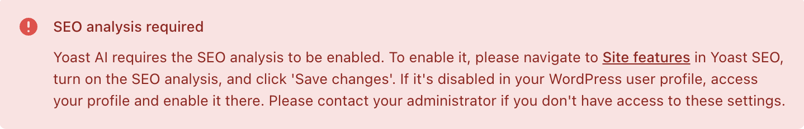

This documentation provides information about the errors displayed by the [Yoast AI features](https://yoast.com/features/ai-generated-titles-and-meta-descriptions/) of the [Yoast SEO Premium](https://yoast.com/wordpress/plugins/seo/) plugin. All Yoast AI features connect to the Yoast AI API, which in turn connects to an AI service provider (currently: [OpenAI](https://openai.com/)). Below, we list the possible error messages based on the [HTTP response status codes](https://developer.mozilla.org/en-US/docs/Web/HTTP/Status) received from this API.

## 400 responses
This section lists the errors that will be displayed for [400 Bad Request](https://developer.mozilla.org/en-US/docs/Web/HTTP/Status/400) responses.

### "Unethical request" error
The Yoast AI features rely on the [Azure OpenAI](https://learn.microsoft.com/en-us/azure/ai-services/openai/concepts/content-filter?tabs=warning%2Cpython-new#text-content) content filtering system, which has a policy against unethical content. The system flags input that includes hate, violence, self-harm references or sexual content. 

This error message is displayed when your content does not pass the content filter system.


<details>
  <summary>Text of error message</summary>

##### Usage policy violation
Due to OpenAI's strict ethical guidelines and [usage policies](https://openai.com/policies/usage-policies/), we cannot enable Yoast AI for your page. If you intend to use AI, kindly avoid the use of explicit, violent, copyrighted, or sexually explicit content. [Read more on how to configure your page to make sure you get the best results with AI](https://yoast.com/help/faq-ai-in-yoast-seo/#utm_medium=software&utm_source=yoast-seo&utm_term=ai-faq&utm_content=faq&php_version=8.1&platform=wordpress&platform_version=6.6.1&software=premium&software_version=23.2&days_active=399&shortlink=ai-generator-configure-page). 

</details>

### "Not enough content" error
The use of Yoast AI requires enough content in your post to create valuable AI suggestions. This error message is displayed when you do not have enough content in your post.


<details>
  <summary>Text of error message</summary>

##### Not enough content
Please try again later. If the issue persists, please [contact our support team]().

</details>

### "Site unreachable" error
The use of Yoast AI requires your site to be publicly accessible. This error message is displayed when that is not the case. 


### "Bad WordPress request" error
In the Yoast SEO plugins for WordPress, we use the WordPress REST interface to connect to our Yoast AI API. This error message is displayed if something went wrong in that connection. 


### Generic 400 error
In the case that we are not able to further refine the 400 error response, this generic error message is displayed.


## 402 responses
This section lists the errors that will be displayed for [402 Payment Required](https://developer.mozilla.org/en-US/docs/Web/HTTP/Status/402) responses.

### Subscription error
The use of Yoast AI requires an active subscription for your site. Please refer to [this page](https://yoast.com/help/faq-ai-in-yoast-seo) to understand the subscriptions required for the Yoast AI features.

This error message is displayed when you do not have the required active subscriptions.


## 408 responses
This section lists the errors that will be displayed for [408 Request Timeout](https://developer.mozilla.org/en-US/docs/Web/HTTP/Status/408) responses.

### "Request timeout" error
The Yoast AI features expect a response from the Yoast AI API within 60 seconds. This error message is displayed when the response is not retrieved within 60 seconds.


## 429 responses
This section lists the errors that will be displayed for [429 Too Many Requests](https://developer.mozilla.org/en-US/docs/Web/HTTP/Status/429) responses.

### Rate limit error
The use of Yoast AI comes with rate limits to ensure fair use. Moreover, we are in the process of introducing a subscription-based limit on the amount of AI generations per month. Please refer to [this page](https://yoa.st/ai-generator-rate-limit-help) to understand the rate limits that are applicable. 

This error message is displayed when you surpass the Yoast AI rate limit for a specific time frame, or (in the future) your Yoast AI sparks limit.


## 403/503 responses
This section lists the errors that will be displayed for [403 Forbidden](https://developer.mozilla.org/en-US/docs/Web/HTTP/Status/403) and [503 Service Unavailable](https://developer.mozilla.org/en-US/docs/Web/HTTP/Status/503) responses.

### Generic error
In the case of all other error responses (i.e., which are not [200 OK](https://developer.mozilla.org/en-US/docs/Web/HTTP/Status/200)), this error message is displayed.


## Other errors

This section lists other errors that can be displayed during the use of Yoast AI features, unconnected to the Yoast AI API.

### "SEO analysis required" error
Our Yoast AI features require the SEO analysis to be enabled in the settings. When a user tries to make use of the AI features without having the SEO analysis enabled, this error message is displayed.



## Mocking these errors

### In WordPress
If you need to display these errors without actually triggering them (e.g., displaying the rate limit error without actually reaching the rate limit), you can do so by replacing the output of the `get_suggestions` or `fix_assessments` functions of `src/actions/ai-generator-action.php` in the Yoast SEO Premium code. Choose one of the errors below:

```php
throw new Bad_Request_Exception( "test", 400, "AI_CONTENT_FILTER" );     // Unethical request error
throw new Bad_Request_Exception( "test", 400, "NOT_ENOUGH_CONTENT" );    // Not enough content error
throw new Bad_Request_Exception( "test", 400, "WP_HTTP_REQUEST_ERROR" ); // Bad WordPress request error
throw new Bad_Request_Exception( "test", 400, "SITE_UNREACHABLE" );      // Site unreachable error
throw new Bad_Request_Exception( "test", 400, "other" );                 // Generic error
throw new Payment_Required_Exception( "test", 402, "test", null, ['Yoast SEO Premium'] ); // Subscription error, replace the array with the missing licenses
throw new Request_Timeout_Exception( "test", 408, "test" );              // Request timeout error
throw new Too_Many_Requests_Exception( "test", 429, "test" );            // Rate limit error
```
