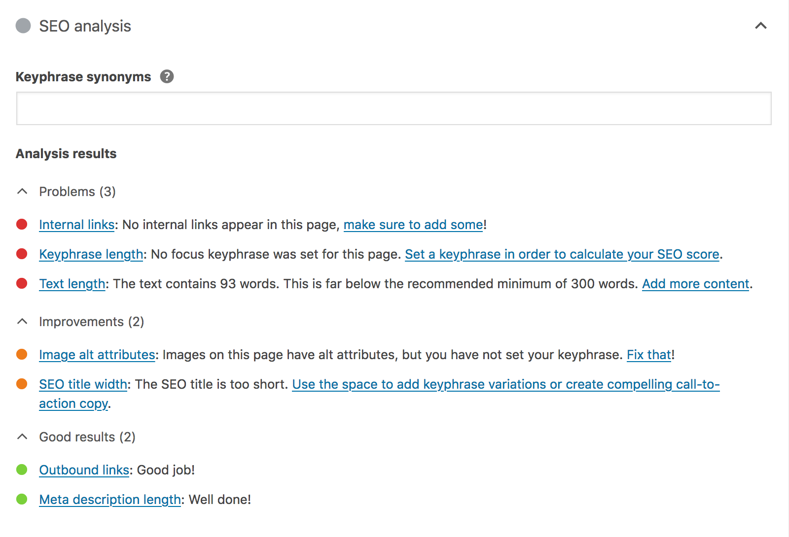

This documentation provides information about how [Yoast SEO](https://yoast.com/wordpress/plugins/seo/) analyzes content.

## Content analysis & meta controls
Our JavaScript content analysis tool, [YoastSEO.js](https://github.com/Yoast/javascript/tree/main/packages/yoastseo), is able to analyze content for a whole range of SEO, accessibility and readability checks.
It contains a 'snippet editor', which generates previews of how the page will (probably) be displayed in Google desktop or mobile search.
It also contains an editor in which users can edit the page's title, URL and meta description intuitively.

Example of the SEO & accessibility checks

Example of the readability checks

Snippet editor (desktop)

Snippet editor (mobile)

These UI elements should be integrated into the content editing experience and should update in a real-time or semi-realtime manner. For inspiration, implementors are recommended to take a look at how these elements are integrated into [Yoast SEO for WordPress](https://wordpress.org/plugins/wordpress-seo/).

## Advanced page controls
Users should also be able to define the following for any given page:

| Setting | Behavior |
| ---- | -- |
| Whether search engines should show the page in search results (yes / no) | Sets a *meta robots* value of `noindex` |
| Whether search engines should follow links on the page (yes / no) | Sets a *meta robots* value of `nofollow` |
| Advanced meta robots directives | Allows users to select additional (valid) *meta robots* values |
| Breadcrumbs title | Defines the title of the page as/when used in breadcrumbs (markup and structured data) |
| Canonical URL | Allows users to define a custom canonical URL value |

## Schema controls
| Setting | Behavior |
| -- | ---- |
| Page type | The type(s) of `WebPage` that should be used in the schema graph |
| Article type | The type(s) of `Article` that should be used in the schema graph. Only available on 'post' types. |
