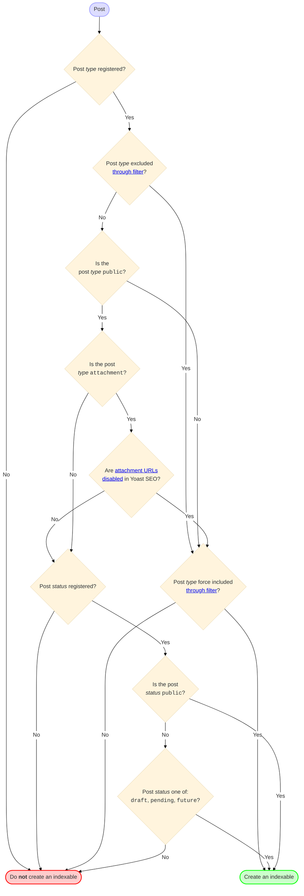
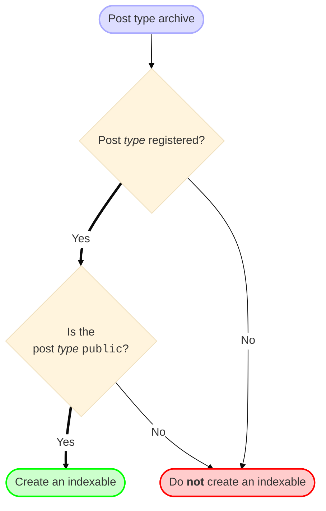
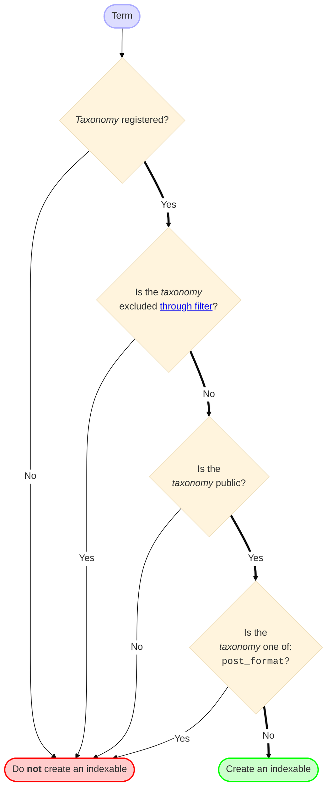
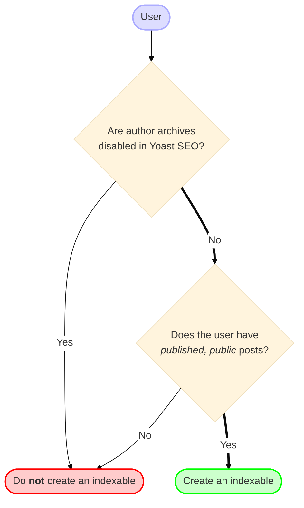

## Introduction

We created indexables for all the indexable objects on your site. All the URLs that a search engine can see. Because of how
WordPress stores content, most of those will be "posts" (pages are considered "posts" in WordPress' data model too). Hence, 
the majority of Indexables on most sites will be posts.

We create some special indexables for things that could otherwise too easily clog up the database. This is specifically true 
for date archives and system pages (search results, 404s). They get one indexable each, that stores our title templates for them
so we can use those on the frontend.

## Which "things" get an indexable?

### Posts

There are quite a few different types of using posts within WordPress. Only those that are publicly viewable should be
considered indexable objects. Of course a post has to _exist_ to be a valid Indexable object.

### Post type archives

A post type archive will only have an indexable when the post type it's registered for is public.

### Terms

A term has to be part of a registered, public taxonomy to be an indexable object.

### Users

Only when a user has published posts that are public, do they get an author archive. At that point, they become an indexable object.

