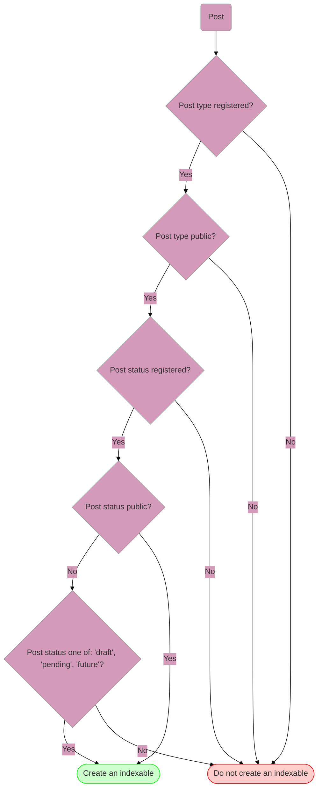
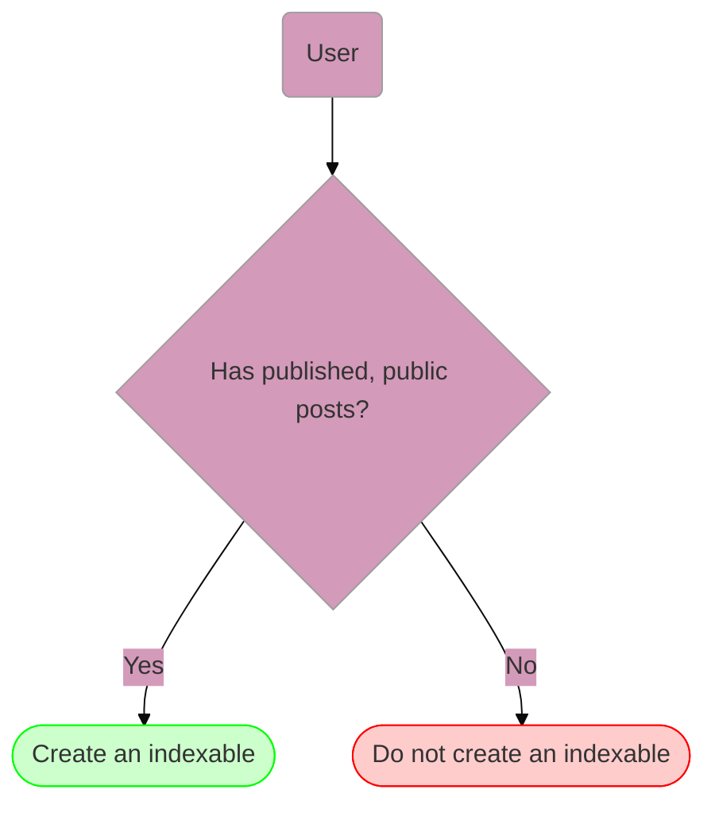

## Which things get an indexable?

### Posts

```mermaid
%%{init: {'theme': 'base', 'themeVariables': { 'primaryColor': '#D49AB9', 'edgeLabelBackground':'#D49AB9', 'stroke':'#000'}}}%%
 flowchart TD
  A(Post) --> B{Post type registered?}
  B -- Yes -->C{Post type public?}
  B -- No -->D([Do not create an indexable])
  C -- Yes -->E{Post status registered?}
  C -- No -->D
  E -- Yes -->F{Post status public?}
  E -- No -->D
  F -- No -->G{Post status one of: 'draft', 'pending', 'future'?}
  F -- Yes -->H([Create an indexable])
  G -- Yes -->H
  G -- No -->D
  style D fill:#ffcccc,stroke:#f00
  style H fill:#ccffcc,stroke:#0f0
```

### Terms

### Users

```mermaid
%%{init: {'theme': 'base', 'themeVariables': { 'primaryColor': '#D49AB9', 'edgeLabelBackground':'#D49AB9', 'stroke':'#000'}}}%%
 flowchart TD
  A(User) --> B{Has published, public posts?}
  B -- Yes -->C([Create an indexable])
  B -- No -->D([Do not create an indexable])
  style D fill:#ffcccc,stroke:#f00
  style C fill:#ccffcc,stroke:#0f0
```

